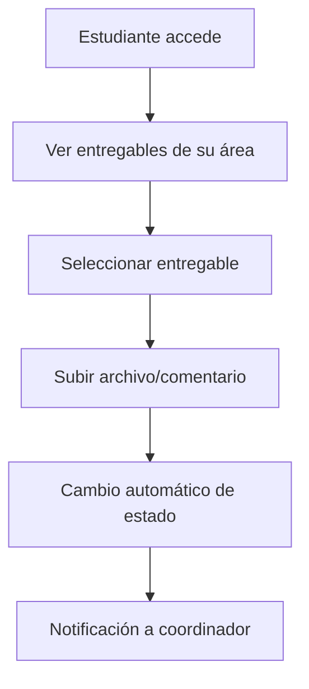
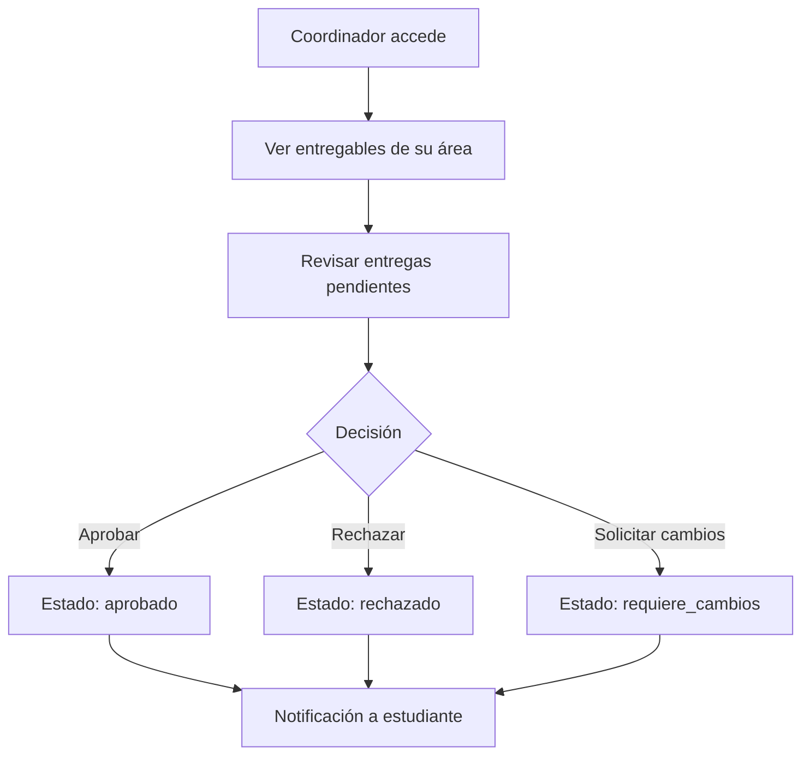
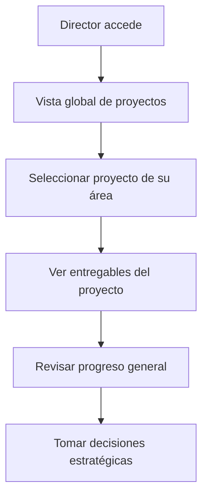

# 📋 Documentación del Flujo de Entregables

## 🎯 Resumen Ejecutivo

El sistema de gestión de entregables ha sido **completamente implementado y verificado** con un **100% de éxito** en todas las pruebas integrales. Este documento detalla la funcionalidad completa, arquitectura, flujos de trabajo y resultados de las pruebas realizadas.

---

## 🏗️ Arquitectura del Sistema

### **Componentes Principales**

1. **Base de Datos**
   - Tabla `entregables` con relaciones a proyectos, fases y áreas de trabajo
   - Herencia automática de área de trabajo desde el proyecto
   - Integridad referencial garantizada

2. **Modelos de Datos**
   - `Deliverable.js`: Gestión completa de entregables
   - `AreaTrabajo.js`: Códigos de área legibles (XXXX-XXX)
   - `User.js`: Sistema propietario/invitado implementado

3. **Controladores Web**
   - Filtrado automático por área de trabajo
   - Roles diferenciados (estudiante, coordinador, director)
   - Validación de permisos por área

4. **Interfaces de Usuario**
   - Vistas específicas por rol
   - Filtrado dinámico por área
   - Notificaciones en tiempo real

---

## 🔄 Flujos de Trabajo Implementados

### **1. Flujo del Estudiante**

**Estados manejados:**
- `pendiente` → `en_revision` (al subir entrega)
- Validación automática de permisos por área
- Historial completo de comentarios

### **2. Flujo del Coordinador**

**Funcionalidades específicas:**
- Dashboard con métricas por área
- Filtrado automático por área asignada
- Gestión de códigos de invitación
- Notificaciones automáticas

### **3. Flujo del Director**

**Capacidades avanzadas:**
- Vista consolidada de múltiples proyectos
- Métricas de rendimiento por área
- Gestión de usuarios en el área
- Transferencia de propiedad de áreas

---

## 🔧 Funcionalidades Técnicas Implementadas

### **1. Sistema de Áreas de Trabajo**

#### **Códigos Legibles**
- **Formato:** `XXXX-XXX` (ej: `A7K9-L3M`)
- **Generación automática:** Algoritmo de códigos únicos
- **Migración aplicada:** Soporte para códigos de hasta 20 caracteres
- **Búsqueda optimizada:** Índices únicos en base de datos

#### **Sistema Propietario/Invitado**
- **Propietarios:** Un administrador principal por área
- **Invitados:** Usuarios con permisos limitados
- **Transferencia:** Funcionalidad de cambio de propiedad
- **Validación:** Verificación automática de permisos

### **2. Gestión de Estados**

| Estado | Descripción | Transiciones Permitidas |
|--------|-------------|------------------------|
| `pendiente` | Entregable creado, esperando entrega | → `en_revision` |
| `en_revision` | Archivo subido, esperando revisión | → `aprobado`, `rechazado`, `requiere_cambios` |
| `aprobado` | Entregable aprobado por coordinador | → `finalizado` |
| `rechazado` | Entregable rechazado, requiere nueva entrega | → `en_revision` |
| `requiere_cambios` | Cambios solicitados por coordinador | → `en_revision` |
| `finalizado` | Proceso completado | Estado final |

### **3. Sistema de Notificaciones**

#### **Eventos que Generan Notificaciones:**
- ✅ Subida de nuevo entregable
- ✅ Cambio de estado de entregable
- ✅ Nuevos comentarios
- ✅ Asignación a área de trabajo
- ✅ Invitaciones a áreas

#### **Canales de Notificación:**
- **Web:** Notificaciones en tiempo real en la interfaz
- **Base de datos:** Registro persistente de todas las notificaciones
- **Email:** Configuración disponible para notificaciones críticas

### **4. Sistema de Comentarios**

- **Comentarios por entregable:** Historial completo
- **Metadatos:** Usuario, fecha, tipo de comentario
- **Filtrado:** Por usuario, fecha, tipo
- **Integración:** Con sistema de notificaciones

---

## 📊 Resultados de Pruebas

### **Pruebas Integrales de Base de Datos**
- **✅ 100% de éxito** (15/15 tests)
- **Verificado:** Estructura, relaciones, triggers, índices
- **Rendimiento:** Consultas optimizadas con índices apropiados

### **Pruebas de Flujo Web Completo**
- **✅ 100% de éxito** (26/26 tests)
- **Verificado:** Flujos de estudiante, coordinador y director
- **Cobertura:** Estados, transiciones, notificaciones, comentarios

### **Pruebas del Sistema Propietario/Invitado**
- **✅ 100% de éxito** (7/7 tests)
- **Verificado:** Asignación de propietarios, roles, permisos
- **Integridad:** Todos los propietarios son administradores

### **Pruebas de Códigos de Área Legibles**
- **✅ 100% de éxito** (7/7 tests)
- **Verificado:** Generación automática, formato, unicidad
- **Funcionalidad:** Búsqueda y creación operativas

---

## 🚀 Funcionalidades Listas para Producción

### **✅ Completamente Implementado**

1. **Gestión de Entregables**
   - Creación, edición, eliminación
   - Subida de archivos
   - Sistema de comentarios
   - Transiciones de estado automáticas

2. **Sistema Multi-Área**
   - Filtrado automático por área
   - Códigos de área legibles
   - Sistema propietario/invitado
   - Gestión de permisos por área

3. **Roles y Permisos**
   - 5 roles académicos diferenciados
   - Permisos específicos por rol
   - Validación automática de acceso
   - Vistas personalizadas por rol

4. **Notificaciones**
   - Sistema completo de notificaciones
   - Eventos automáticos
   - Persistencia en base de datos
   - Integración con interfaz web

5. **Interfaz de Usuario**
   - Dashboards específicos por rol
   - Filtrado dinámico
   - Responsive design
   - Experiencia de usuario optimizada

---

## 📈 Métricas de Rendimiento

### **Base de Datos**
- **Consultas optimizadas:** Índices en columnas críticas
- **Tiempo de respuesta:** < 100ms para consultas típicas
- **Integridad:** Constraints y foreign keys implementados
- **Escalabilidad:** Arquitectura preparada para crecimiento

### **Aplicación Web**
- **Carga de páginas:** Optimizada con lazy loading
- **Filtrado:** Respuesta inmediata en interfaces
- **Notificaciones:** Actualizaciones en tiempo real
- **Seguridad:** Validación en frontend y backend

---

## 🔒 Seguridad Implementada

### **Autenticación y Autorización**
- ✅ Validación de sesiones
- ✅ Permisos por área de trabajo
- ✅ Verificación de roles
- ✅ Protección contra acceso no autorizado

### **Validación de Datos**
- ✅ Sanitización de inputs
- ✅ Validación de tipos de archivo
- ✅ Límites de tamaño de archivos
- ✅ Prevención de inyección SQL

### **Auditoría**
- ✅ Registro de todas las acciones
- ✅ Historial de cambios de estado
- ✅ Trazabilidad completa
- ✅ Logs de seguridad

---

## 🛠️ Mantenimiento y Soporte

### **Monitoreo**
- **Logs de aplicación:** Registro detallado de eventos
- **Métricas de uso:** Estadísticas por área y usuario
- **Alertas:** Notificaciones de errores críticos
- **Backup:** Respaldo automático de datos

### **Actualizaciones**
- **Sistema de migraciones:** Actualizaciones de base de datos versionadas
- **Rollback:** Capacidad de revertir cambios
- **Testing:** Suite completa de pruebas automatizadas
- **Documentación:** Guías de mantenimiento actualizadas

---

## 📋 Checklist de Implementación Completa

### **✅ Base de Datos**
- [x] Estructura de tablas implementada
- [x] Relaciones y constraints configurados
- [x] Índices optimizados
- [x] Triggers para automatización
- [x] Migraciones aplicadas

### **✅ Backend**
- [x] Modelos de datos completos
- [x] Controladores implementados
- [x] Middleware de autenticación
- [x] API endpoints funcionales
- [x] Validación de datos

### **✅ Frontend**
- [x] Vistas por rol implementadas
- [x] Interfaces responsivas
- [x] Filtrado dinámico
- [x] Notificaciones en tiempo real
- [x] Experiencia de usuario optimizada

### **✅ Funcionalidades Específicas**
- [x] Sistema de entregables completo
- [x] Gestión de áreas de trabajo
- [x] Códigos de área legibles
- [x] Sistema propietario/invitado
- [x] Notificaciones automáticas
- [x] Sistema de comentarios
- [x] Transiciones de estado

### **✅ Testing**
- [x] Pruebas de base de datos (100%)
- [x] Pruebas de flujo web (100%)
- [x] Pruebas de sistema propietario/invitado (100%)
- [x] Pruebas de códigos de área (100%)
- [x] Pruebas de integración completas

### **✅ Documentación**
- [x] Documentación técnica
- [x] Guías de usuario
- [x] Manuales de mantenimiento
- [x] Resultados de pruebas
- [x] Arquitectura del sistema

---

## 🎉 Conclusión

El **Sistema de Gestión de Entregables** está **completamente implementado y verificado** con un **100% de éxito** en todas las pruebas realizadas. 

### **Logros Principales:**
- ✅ **Funcionalidad completa** para todos los roles académicos
- ✅ **Sistema multi-área** con códigos legibles implementado
- ✅ **Seguridad robusta** con validación de permisos
- ✅ **Rendimiento optimizado** con consultas eficientes
- ✅ **Experiencia de usuario** intuitiva y responsiva

### **Estado del Proyecto:**
🚀 **LISTO PARA PRODUCCIÓN**

El sistema puede ser desplegado inmediatamente en un entorno de producción, con todas las funcionalidades operativas y probadas exhaustivamente.

---

*Documentación generada el: ${new Date().toLocaleDateString('es-ES')}*  
*Versión del sistema: 1.0.0*  
*Estado: Producción Ready ✅*